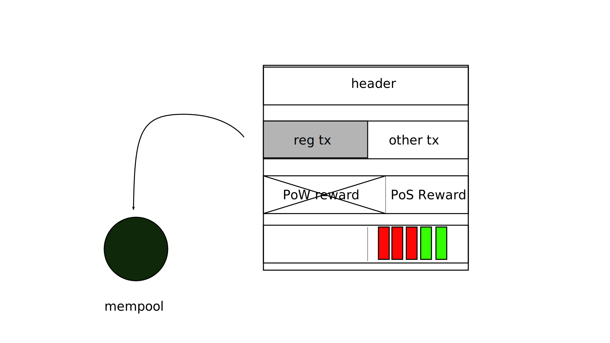

## Decred In Depth: Proof-of-stake Voting

### Storyboard
**Estimated Runtime:**

No. | VISUAL | DESCRIPTION | TIME
:-: | :----: | :---- | :--:
1 |  | Thumbnail |  
2 | ? | **VO**: Without a form of on-chain governance, pure proof-of-work currencies like Bitcoin are at the mercy of their miners. With no way to keep proof-of-work miners in check *or* agree on consensus rule changes, **action**:  |  
3 |  | **VO**: Bitcoin leaves itself open to 51% attacks and community splitting hard forks. **action**:  |  
4 |  | ****VO**: Decred's** **Proof-of-Stake Voting** system, (which is part of its hybrid proof-of-work - proof-of-stake protocol), **action**:  |  
5 | ? | **VO**: puts power in the hands of its stakeholders, not its miners. **action**: stakeholder becomes larger than miner |  
6 |  | **VO**: By participating in proof-of-stake voting, stakeholders can stop 51% attacks, prevent unwanted hard forks, and shape the future of the project. **action**:  |  
7 | transition | **VO**: Here's how it works: **action**:  |  
8 | ? | **VO**: Decred Proof-of-stake voting is a ticket-based lottery system. **action**:  |  
9 |  | **VO**: Stakeholders prove their stake by time-locking funds in exchange for tickets. **action**: dcr funds locked and ticket dispensed |  
10 |  | **VO**: Each ticket owned offers a chance to participate in the governance of the project by casting votes. **action**:  |  
11 | stepped Graph showing ratio of dcr owned to potential # of tickets | **VO**: The more tickets a stakeholder can acquire the more votes they can cast. **action**:  |  
12 | Graph of ticket price over time. **Text:** (144 blocks * 5) / 60 = ~12 hours | **VO**: The *price* of a ticket is automatically adjusted by an algorithm at the end of each **ticket window** of 144 blocks; (about 12 hours, given Decred's average **block time** of roughly 5 minutes.) **action**:  |  
13 | Graph of ticket pool size over time | **VO**: This keeps the number of *live* tickets in the system as close as possible to the target 40,960 tickets. **action**:  |  
14 |  | **VO**: A ticket's life *begins* when it is first mined into a block, and *ends* when it is drawn from the ticket pool. **action**:  |  
15 |  | **VO**: Before it is added to the ticket pool, a ticket must go through the immature stage. During this stage, the stakeholder's funds used to acquire the ticket are locked, but the ticket is not yet eligible to be drawn. **action**:  |  
16 |  | **VO**: After 256 blocks (or about 21 hours), immature tickets become live and are added to the **ticket pool**. **action**:  |  
17 | ? | **VO**: With each block, 5 tickets are randomly drawn from the ticket pool. **action**:  |  
18 |  | **VO**: How long an individual ticket will wait in the pool before being drawn is entirely up to chance, but current data shows the average waiting time is 30 days. **action**:  |  
19 |  | **VO**: In rare circumstances, it is possible for a ticket to never be drawn. This occurs with less than 1 percent of all tickets and results in a full refund of the expired ticket's price. **action**:  |  
20 |  | **VO**: Once their ticket is drawn, a ticketholder's votes must be broadcast to the network from either their own *self-hosted* **voting wallet** or a designated **voting service provider** for inclusion the next block. **action**:  |  
21 |  | **VO**: If votes are not broadcast quickly enough, their intended block may be mined without them. This occurs in less than 2% of cases and results in a full refund of the missed ticket's price. **action**:  |  
22 |  | **VO**: For each drawn ticket, a ticketholder may cast one **block vote** and zero to many **consensus votes** to be recorded *on-chain*. **action**:  |  
23 | scale? | **VO**: Block votes allow ticketholders to keep proof-of-work miners in check. **action**:  |  
24 | technical diagram of a block | **VO**: The 5 block votes contained in each new block decide whether to accept or reject the previous one. **action**: block votes 'reject' block |  
25 | 1s | **VO**: If stakeholders decide to reject the block, its regular transactions are returned to the mempool and the miner is stripped of their block reward. **action**:  |  
26 |  | **VO**: Consensus votes allow ticketholders to prevent unwanted hard-forks through a two stage process where stakeholders vote for or against changes to Decred's consensus rules. **action**:  |  
27 | ? | **VO**: Before the consensus voting process can begin, a majority of nodes must update to the newly released software version containing the dormant rule change. **action**:  |  
28 |  | **VO**: The update threshold is met when 95% of the 1000 most recent blocks were found by updated miners and 75% of the proof of stake votes within *one* **stake version interval**, 2016 blocks (or about 1 week), were cast by updated voting wallets. **action**:  |  
29 |  | **VO**: After the update threshold is met voting will begin on the *first block* of the next **rule change interval**. **action**: SVI blocks are added one by one |  
30 |  | **VO**: Each rule change interval spans 8,064 blocks (or about 4 weeks) during which votes for any active rule change processes are collected. **action**: SVI's continue to be added. The last block is added then the timeline slides to the left to make room for the next RCI |  
31 |  | **VO**: A revote occurs if 90% of votes collected during the entire interval abstain. **action**:  |  
32 |  | **VO**: Else, if 75% of non-abstaining votes signal yes, then the proposed rule changes will be activated at the end of the *next* rule change interval. **action**:  |  
33 |  | **VO**: After a ticketholder's votes has been included in a block and a 256 block immaturity phase has passed, **action**:  |  
34 |  | **VO**: the price of the voted ticket is fully refunded and a portion of the Decred block reward is credited to their account as compensation for their active participation. **action**:  |  
35 |  | **VO**: On-chain voting allows stakeholders to govern the chain, but what about governance of the project itself? **action**:  |  
36 |  | **VO**: While their live tickets are waiting in the ticket pool, ticketholders have access to proposal voting through Politeia, Decred's chain-anchored proposal system. **action**:  |  
37 | pi mockup with example proposals | **VO**: Through Politeia anyone can shape the future of Decred by proposing new ideas for stakeholder consideration in an off-chain yet cryptographically verifiable manner. **action**:  |  
38 |  | **VO**: To begin participating in the governance of Decred, download Decrediton at Decred.org **action**:  |  
39 |  |**VO**: and up your stake by purchasing decred at any one of the many supporting exchanges. **action**: |  
40 |  | **VO**: Decred; Decentralized credits. **action**:  |  
41 |  | End-card |  
